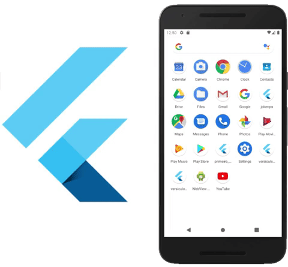

## 📜 Versículos bíblicos
<h1 align="center">
    
</h1>

## 👨‍💻 Sobre o projeto

O aplicativo Versículos bíblicos teve como principal objetivo o entendimento dos principais fundamentos é aspectos para criar a primeira aplicação em Flutter.

Conheça mais da tecnologia utilizada no projeto em:

- [Flutter](https://flutter.dev/)

## 📄 Licença

O projeto está sob a licença MIT, saiba mais em:

[LICENSE](https://pt.wikipedia.org/wiki/Licen%C3%A7a_MIT)

---

Feito com ❤️ por Daniel Pádua
